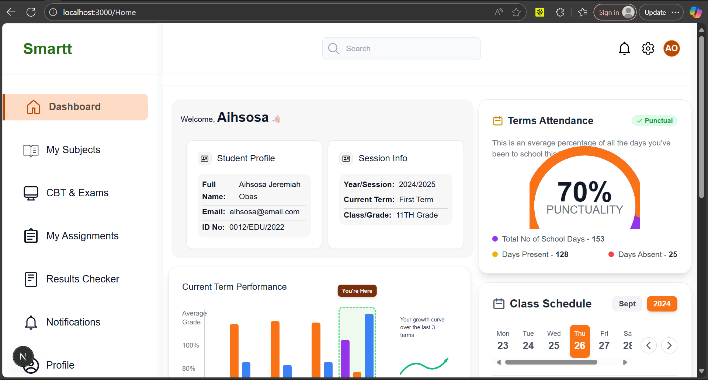

# 📊 Smart Dashboard App

A modern, responsive dashboard built with **Next.js**, **TypeScript**, and **Tailwind CSS**, integrated with **Firebase** for authentication and data management.  
This project showcases clean UI design, component reusability, and real-time data interaction.

---

## 🚀 Features

- 🔐 **Firebase Authentication** — Secure login and signup system  
- 📈 **Interactive Dashboard** — Real-time stats and analytics  
- 🧩 **Modular Components** — Sidebar, Navbar, and Widget-based layout  
- 🎨 **Tailwind CSS Styling** — Consistent, responsive design  
- ⚙️ **TypeScript Support** — Full type safety  
- 🗂️ **Firestore Integration** — Store and update user data dynamically  

---

## 🖼️ Preview



>

---

## 🏗️ Tech Stack

| Technology | Purpose |
|-------------|----------|
| **Next.js** | Frontend framework for React |
| **TypeScript** | Type-safe JavaScript |
| **Tailwind CSS** | Utility-first styling |
| **Firebase** | Authentication and Firestore database |
| **React Icons** | Icon set used in UI |
| **Icons.xyz** | svg Icons used in UI |


---

## 🏗️ Future Improvement 
- dashboard links 
- Add notifications panel 
- Dark mode toggle 
- Responsive layout(would optimize that later)


## 📁 Folder Structure

```bash
src/
 ┣ components/
 ┃ ┣ Sidebar.tsx
 ┃ ┣ Navbar.tsx
 ┃ ┗ DashboardCard.tsx
 ┣ app/
 ┃ ┣ page.tsx
 ┃ ┗ layout.tsx
 ┣ lib/
 ┃ ┗ firebase.ts
 ┗ styles/
    ┗ globals.css

---
```firebase

## Configure Firebase 
NEXT_PUBLIC_FIREBASE_API_KEY=your_api_key
NEXT_PUBLIC_FIREBASE_AUTH_DOMAIN=your_auth_domain
NEXT_PUBLIC_FIREBASE_PROJECT_ID=your_project_id
NEXT_PUBLIC_FIREBASE_STORAGE_BUCKET=your_storage_bucket
NEXT_PUBLIC_FIREBASE_MESSAGING_SENDER_ID=your_sender_id
NEXT_PUBLIC_FIREBASE_APP_ID=your_app_id

Run the app: ```bash
npm run dev
# or
yarn dev
# or
pnpm dev
# or
bun dev
```


🧠 Learnings

- Setting up Firebase authentication with Next.js

- Managing global state and user sessions

- Designing reusable components with Tailwind CSS

- Working with Firestore updates and queries

🧑‍💻 Author

Taiwo Ibrahim
Frontend Developer | Technical Writer

📧 [ibrahimtaiwoti@gmail.com.com
]
🔗 https://github.com/Taiwo-ibrahim